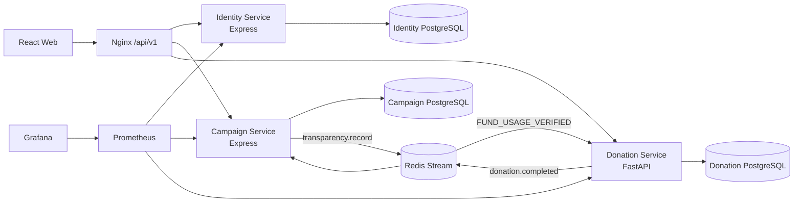

# CharityConnect — Kết nối từ thiện & quyên góp

## Chạy demo nhanh trên Windows

Nhấp đúp `INSTALL_AND_RUN.bat`. Script tự kiểm tra Node.js/Python, cài thư viện,
khởi động web tại `http://127.0.0.1:5173` và trợ lý Python tại
`http://127.0.0.1:8001`. Chế độ này không cần Docker và không cần API key.

Tài khoản demo dùng chung mật khẩu `Demo@123`:

- Người quyên góp: `donor@demo.vn`
- Tổ chức: `org@demo.vn`
- Quản trị viên: `admin@demo.vn`

Chạy `RUN_TESTS.bat` để kiểm thử service, mock API và production build.

Trợ lý mặc định trả lời offline. Để bật OpenAI API, chạy `SET_OPENAI_KEY.bat`;
script nhập key ở chế độ ẩn và lưu `OPENAI_API_KEY` vào `.env` đã bị Git bỏ qua.
Bot ưu tiên knowledge base và API nội bộ CharityConnect. Chỉ câu hỏi ngoài phạm vi mới dùng
`web_search`, luôn trả URL nguồn; bot giữ tối đa 6 lượt và che email, số điện thoại, API key.

## Cấu hình tùy chọn

Demo local chạy đầy đủ mà không cần secret. Khi cần bật dịch vụ thật, điền các biến trong `.env` theo `.env.example`:

- OpenAI: `OPENAI_API_KEY`. Câu hỏi CharityConnect vẫn không gọi web search.
- Gmail: `GMAIL_CLIENT_ID`, `GMAIL_CLIENT_SECRET`, `GMAIL_SENDER_EMAIL`, rồi chạy `cd services/identity && npm run gmail:authorize`. Refresh token được ghi thẳng vào `.env`, không in ra terminal.
- Sepolia: `ANCHOR_RPC_URL` và `ANCHOR_PRIVATE_KEY`. Nếu để trống, nút “Tạo điểm neo” dùng `LOCAL_SIMULATION` và không tốn gas.

Không ghi API key, OAuth token hay private key vào source code.

Website tiếng Việt Level 3 cho ba vai trò: người quyên góp, tổ chức từ thiện và quản trị viên. Luồng cốt lõi: **xác minh tổ chức → duyệt chiến dịch → quyên góp mô phỏng → biên nhận → báo cáo sử dụng quỹ → sổ cái minh bạch**.

## Chạy dự án

### Chỉ chạy giao diện

Không mở trực tiếp `web/index.html` bằng `file://`; Vite cần HTTP server.

Trên Windows, chạy:

```text
START_FRONTEND.cmd
```

Sau đó mở <http://localhost:5173>. Script này bật **chế độ mô phỏng trên trình duyệt**, vì vậy có thể trình diễn đầy đủ các luồng chính mà không cần Docker. Dữ liệu demo được lưu trong `localStorage`; backend thật không bị thay đổi.

Tài khoản demo (mật khẩu chung `Demo@123`):

| Vai trò | Email | Chức năng mô phỏng |
|---|---|---|
| Người quyên góp | `donor@demo.vn` | Quyên góp, ẩn danh, QR biên nhận, lịch sử |
| Tổ chức | `org@demo.vn` | Tạo chiến dịch và nộp báo cáo sử dụng quỹ có bằng chứng |
| Quản trị viên | `admin@demo.vn` | Duyệt tổ chức, chiến dịch và báo cáo tác động |

Khách chưa đăng nhập vẫn xem được danh sách và chi tiết chiến dịch. Quyên góp, quản lý tổ chức và kiểm duyệt bắt buộc đăng nhập đúng vai trò.

### Chạy toàn bộ hệ thống

Yêu cầu Docker Desktop đang hoạt động. Chạy:

```text
START_ALL.cmd
```

Hoặc:

```bash
copy .env.example .env
docker compose up --build
```

Nếu đã có volume PostgreSQL từ bản `001`, áp dụng migration không phá dữ liệu trước khi khởi động service:

```bash
docker compose exec -T campaign-db psql -U campaign -d campaign -f /docker-entrypoint-initdb.d/002_impact_reports.sql
docker compose exec -T campaign-db psql -U campaign -d campaign -f /docker-entrypoint-initdb.d/003_campaign_escrow.sql
docker compose exec -T donation-db psql -U donation -d donation -f /docker-entrypoint-initdb.d/002_transparency_ledger.sql
docker compose exec -T donation-db psql -U donation -d donation -f /docker-entrypoint-initdb.d/003_analytics_indexes.sql
docker compose exec -T donation-db psql -U donation -d donation -f /docker-entrypoint-initdb.d/004_trustchain_merkle.sql
docker compose exec -T identity-db psql -U identity -d identity -f /docker-entrypoint-initdb.d/002_email_notifications.sql
```

| Thành phần | URL |
|---|---|
| Web | <http://localhost:5173> |
| API Gateway | <http://localhost:8080/api/v1> |
| Grafana | <http://localhost:3000> |
| Prometheus | <http://localhost:9090> |
| SonarQube | `docker compose --profile quality up sonarqube` → <http://localhost:9000> |

Tài khoản quản trị seed: `admin@charityconnect.vn` / `Admin@123`. Hãy đổi mật khẩu/seed trước khi dùng ngoài môi trường local.

## Luồng demo

1. Đăng ký tài khoản `ORGANIZATION`, nộp hồ sơ xác minh.
2. Đăng nhập admin, xác minh tổ chức.
3. Tổ chức tạo chiến dịch, nộp duyệt.
4. Admin duyệt chiến dịch.
5. Đăng ký `DONOR`, mở chiến dịch và quyên góp mô phỏng.
6. Xem biên nhận/lịch sử; tiến độ chiến dịch được cập nhật qua Redis Stream.
7. Tổ chức nộp báo cáo sử dụng quỹ; admin duyệt để neo đúng một bản ghi `FUND_USAGE_VERIFIED`.
8. Mở `/minh-bach` kiểm tra toàn chuỗi hoặc `/xac-minh-bien-nhan` để đối chiếu QR/mã biên nhận.

## Kiến trúc



Mỗi service chỉ truy vấn database của mình. Campaign kiểm tra trạng thái tổ chức qua internal API; Donation kiểm tra điều kiện chiến dịch qua internal API. Các internal endpoint yêu cầu `x-internal-token`.

Donation ghi giao dịch, biên nhận và outbox trong cùng transaction. Publisher đẩy `donation.completed`; Campaign lưu `event_id` vào `processed_donation_events` bằng khóa duy nhất trước khi cộng `raised_amount`, do đó event bị phát lại không cộng tiền hai lần.

Donation Service sở hữu hash-chain SHA-256 trong `ledger_entries`. Mỗi hash được tính từ canonical JSON của toàn bộ bản ghi cùng `previous_hash`; genesis dùng 64 số `0`. PostgreSQL advisory lock tuần tự hóa thao tác append và khóa unique `event_id` ngăn hiệu ứng trùng. Tối đa 100 ledger hash liên tục được gom thành Merkle root; admin chủ động tạo anchor. Thiếu cấu hình Sepolia thì anchor là `SIMULATED`, có cấu hình mới ký EIP-1559 và gửi root làm calldata. Payload công khai tuyệt đối không chứa tên, email hoặc donor ID. Đây là sổ cái chống sửa dữ liệu, **không phải blockchain phi tập trung và không dùng crypto/token/ví**.

## Trạng thái nghiệp vụ

- `Role`: `DONOR | ORGANIZATION | ADMIN`
- `OrganizationStatus`: `PENDING | VERIFIED | REJECTED`
- `CampaignStatus`: `DRAFT | PENDING_REVIEW | APPROVED | REJECTED | CLOSED`
- `DonationStatus`: `COMPLETED | FAILED`
- `LedgerEventType`: `DONATION_COMPLETED | FUND_USAGE_VERIFIED`
- `LedgerProofStatus`: `CONFIRMED | PENDING | INVALID`
- `ImpactReportStatus`: `PENDING_REVIEW | VERIFIED | REJECTED`
- `AnchorStatus`: `SIMULATED | PENDING | CONFIRMED | FAILED`
- `ContractState`: `CREATED | APPROVED | DONATION_OPEN | FUND_LOCKED | USAGE_SUBMITTED | USAGE_VERIFIED | FUND_RELEASED | CLOSED`

Chỉ tổ chức `VERIFIED` được nộp chiến dịch. Chỉ chiến dịch `APPROVED`, chưa hết hạn và chưa đóng được nhận quyên góp. Ẩn danh chỉ che tên khỏi tổ chức; hệ thống vẫn lưu donor để đối soát.

## API

Gateway công khai dưới `/api/v1`:

- Identity: `/auth/*`, `/profile`, `/organizations/*`, `/admin/organizations/*`
- Campaign: `/campaigns/*`, `/organization/campaigns/*`, `/admin/campaigns/*`
- Impact: `/campaigns/{id}/impact-reports`, `/organization/campaigns/{id}/impact-reports`, `/admin/impact-reports/*`
- Donation: `/donations/*`, `/organization/donations/*`, `/transparency/*`

OpenAPI:

- Identity: `http://identity-service:3001/openapi.json`
- Campaign: `http://campaign-service:3002/openapi.json`
- Donation: `http://donation-service:8000/openapi.json` hoặc `/docs`

## Kiểm thử và quality gate

```bash
cd services/identity && npm ci && npm test && npm run build
cd services/campaign && npm ci && npm test && npm run build
cd services/donation && pip install -r requirements.txt && pytest
cd web && npm ci && npm run build
```

Ngưỡng coverage bắt buộc: 80%. Kết quả baseline hiện tại:

- Identity: 81,78% statements, 25 test.
- Campaign: 82,53% statements, 27 test.
- Donation: 85,22% tổng coverage, 33 test.
- Assistant: 91,91% tổng coverage, 38 test.
- Mock API frontend: 90,46% statements, 12 test; production build đã pass.

Load test:

```bash
k6 run -e DONOR_TOKEN=... -e CAMPAIGN_ID=... load-tests/donation.js
k6 run -e ADMIN_TOKEN=... load-tests/moderation.js
```

Mục tiêu local: p95 dưới 750 ms và error rate dưới 1%.

## SPQM, KPI và evidence

Khung KPI đầy đủ nằm tại [tài liệu SPQM/KPI](../outputs/CharityConnect_SPQM_KPI_Framework.md). KPI bổ sung gồm chain integrity 100%, duplicate ledger effect 0, ledger append lag p95 < 5 giây, evidence review p95 < 48 giờ và fund-usage consistency = 0 VND. Risk register dùng công thức tự động `Risk Score = Effort × Impact × Risk Size`, ngưỡng Low `<30`, Medium `30–59,99`, High `≥60`.

Prometheus thu thập request rate, latency, error, health và số donation hoàn tất/thất bại. Grafana được provision sẵn dashboard `CharityConnect Level 3`. GitHub Actions chạy test, coverage, build Docker và Sonar Quality Gate khi cấu hình `SONAR_TOKEN`/`SONAR_HOST_URL`.

## ETVX

- **Xác minh tổ chức:** Entry = tài khoản organization + hồ sơ; Task = nộp và review; Validation = quyền, dữ liệu, audit; Exit = `VERIFIED` hoặc `REJECTED`.
- **Duyệt chiến dịch:** Entry = organization đã xác minh; Task = tạo/nộp/review; Validation = state machine, ownership, cache invalidation; Exit = `APPROVED` hoặc `REJECTED`.
- **Quyên góp:** Entry = donor đăng nhập + campaign hợp lệ; Task = tạo donation/receipt/outbox; Validation = ledger, stream idempotency; Exit = receipt và tiến độ tăng đúng một lần.
- **Báo cáo tác động:** Entry = chiến dịch thuộc tổ chức và ở `APPROVED/CLOSED`; Task = nộp 1–5 bằng chứng và kiểm duyệt; Validation = ownership, type/size/hash file, giới hạn số tiền và outbox idempotent; Exit = báo cáo công khai, số dư minh bạch và một ledger entry.
- **CI gate:** Entry = PR; Task = lint/test/build/Sonar; Validation = coverage và quality gate; Exit = merge hoặc trả lại để sửa.

## COBIT, ISO và CMMI

- COBIT: Plan & Organize qua kiến trúc/KPI/risk; Acquire & Implement qua CI/test/CM; Deliver & Support qua health/log/receipt; Monitor & Evaluate qua Grafana/Sonar/PDCA.
- ISO 9001: trách nhiệm và nguồn lực được xác định; ETVX kiểm soát hiện thực hóa sản phẩm; đo lường–phân tích–cải tiến dựa trên KPI.
- CMMI Level 1–3 evidence: requirement traceability, sprint planning/monitoring, MA/PPQA, configuration management, verification/validation và causal analysis.

## Phạm vi loại trừ

Không có thanh toán thật, chat, bình luận, quyên góp định kỳ, mạng xã hội, bản đồ, blog, đa tiền tệ hoặc hệ thống gợi ý.
# CharityConnect deployment note

Xem cấu trúc FE/BE, phân quyền tài khoản và chính sách dữ liệu bất biến trong [PROJECT_STRUCTURE.md](PROJECT_STRUCTURE.md).

- Vercel frontend: Root Directory `web`, build command `npm run build`, output `dist`, env demo `VITE_USE_MOCK_API=true`; file `web/vercel.json` đã có rewrite SPA cho React Router.
- Nếu deploy từ root monorepo, có thể dùng `vercel.json` ở thư mục gốc để build `web`.
- Backend full-stack: chạy Docker services trên Render/Railway/VPS, gateway public `/api/v1`, mỗi service dùng database riêng và Redis managed.
- Không commit `.env`, API key, Gmail OAuth, Sepolia key hoặc database URL.
