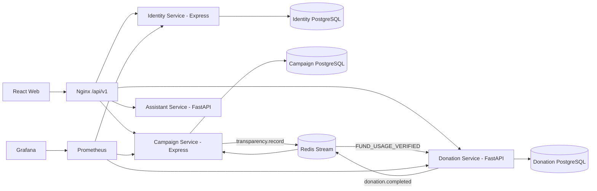

# CharityConnect — Kết nối từ thiện & quyên góp minh bạch

CharityConnect là nền tảng web tiếng Việt cho ba vai trò: người quyên góp, tổ chức từ thiện và quản trị viên. Hệ thống tập trung vào kiểm chứng nguồn, chiến dịch đã duyệt, quyên góp có biên nhận, báo cáo sử dụng quỹ, TrustChain/hash-chain và dashboard thống kê minh bạch.

## Chạy nhanh giao diện

Yêu cầu Node.js 20+.

```bash
cd frontend
npm install
npm run dev
```

Mở <http://localhost:5173>. Ở chế độ dữ liệu cục bộ, web vẫn chạy đầy đủ các luồng chính mà không cần Docker hoặc API key.

Tài khoản mẫu dùng chung mật khẩu `Demo@123`:

| Vai trò | Email | Chức năng chính |
|---|---|---|
| Người quyên góp | `donor@demo.vn` | Quyên góp, lưu/theo dõi chiến dịch, thông báo, biên nhận, lịch sử và PDF |
| Tổ chức | `org@demo.vn` | Quản lý chiến dịch, ngân sách, milestone và báo cáo sử dụng quỹ |
| Quản trị viên | `admin@demo.vn` | Kiểm duyệt, quản lý tài khoản, Risk Score, Audit Log và TrustChain anchor |

Khách chưa đăng nhập xem được kiểm chứng nguồn, chiến dịch, thống kê, sổ cái minh bạch và xác minh biên nhận. Các chức năng theo vai trò yêu cầu đăng nhập đúng quyền.

## Cấu hình tùy chọn

Khi cần kết nối dịch vụ thật, sao chép `.env.example` thành `.env` và điền biến môi trường tương ứng.

- AI Assistant: `ANTHROPIC_API_KEY` hoặc `OPENAI_API_KEY`. Bot ưu tiên dữ liệu nội bộ CharityConnect; câu hỏi ngoài phạm vi mới dùng tìm kiếm web có URL nguồn nếu provider được cấu hình.
- Google Sign-In: tạo **OAuth client → Web application** trong [Google Cloud Console](https://console.cloud.google.com/apis/credentials), khai báo đúng `Authorized JavaScript origins` cho URL frontend (ví dụ `http://127.0.0.1:5173` và domain Vercel), sau đó điền cùng một Client ID vào `VITE_GOOGLE_CLIENT_ID` (frontend) và `GOOGLE_CLIENT_ID` (Identity Service). Đăng nhập Google chỉ bật khi frontend dùng backend thật: `VITE_USE_MOCK_API=false`.
- Gmail: `GMAIL_CLIENT_ID`, `GMAIL_CLIENT_SECRET`, `GMAIL_SENDER_EMAIL`, sau đó chạy `cd backend/identity && npm run gmail:authorize`. Refresh token được ghi vào `.env` và không được commit.
- Sepolia: `ANCHOR_RPC_URL`, `ANCHOR_PRIVATE_KEY`, `ANCHOR_CHAIN_ID=11155111`, `ANCHOR_EXPLORER_URL`. Nếu không cấu hình, anchor chạy ở chế độ nội bộ `LOCAL_SIMULATION`.

Không ghi API key, OAuth token, private key, database URL hoặc file `.env` vào source code.

## Cấu hình đăng nhập nhanh bằng Google

1. Vào **Google Cloud Console → APIs & Services → Credentials**, tạo OAuth Client ID loại **Web application**.
2. Thêm từng domain frontend vào **Authorized JavaScript origins**: `http://127.0.0.1:5173` cho local, rồi thêm chính xác URL Vercel/Render khi deploy. Không thêm đường dẫn như `/dang-nhap` vào origin.
3. Với local Docker, sao chép `.env.example` thành `.env` rồi điền cùng một Client ID cho frontend và Identity Service:

```env
VITE_USE_MOCK_API=false
VITE_API_BASE_URL=/api/v1
VITE_GOOGLE_CLIENT_ID=xxxxx.apps.googleusercontent.com
GOOGLE_CLIENT_ID=xxxxx.apps.googleusercontent.com
CORS_ORIGINS=http://localhost:5173,http://127.0.0.1:5173
```

4. Với Vercel, đặt `VITE_USE_MOCK_API=false`, `VITE_API_BASE_URL=https://<gateway-domain>/api/v1` và `VITE_GOOGLE_CLIENT_ID` trong Environment Variables rồi redeploy. Với Identity Service trên Render/Railway, đặt `GOOGLE_CLIENT_ID` cùng giá trị và `CORS_ORIGINS=https://<vercel-domain>`.
5. Với database Identity đã tồn tại, chạy migration `backend/identity/sql/007_google_sign_in.sql` và `008_user_profile_details.sql` trước khi deploy service mới.

`VITE_GOOGLE_CLIENT_ID` là định danh công khai của ứng dụng Web, không phải client secret. Không đặt Google client secret, access token hoặc API key vào frontend. Bản frontend chạy dữ liệu local sẽ ẩn nút Google vì không có backend để xác minh ID token.

### Render/Railway cho Identity Service

Google Sign-In cần một backend Identity thật; chỉ deploy frontend trên Render/Vercel sẽ không thể xác minh token. Khi tạo service Identity, chọn Root Directory `backend/identity` và Dockerfile trong thư mục đó. Cấu hình tối thiểu:

```env
PORT=3001
DATABASE_URL=postgresql://...
JWT_SECRET=<một chuỗi ngẫu nhiên dài>
INTERNAL_SERVICE_TOKEN=<một chuỗi ngẫu nhiên dài>
GOOGLE_CLIENT_ID=xxxxx.apps.googleusercontent.com
CORS_ORIGINS=https://<frontend-domain>
PUBLIC_WEB_URL=https://<frontend-domain>
```

Gateway cần chuyển `/api/v1/auth/google` về Identity Service. Frontend production phải dùng `VITE_USE_MOCK_API=false` và `VITE_API_BASE_URL=https://<gateway-domain>/api/v1`. Sau khi đổi biến `VITE_*`, redeploy frontend vì Vite nhúng các biến này vào bundle lúc build.

## Chạy toàn bộ hệ thống

Yêu cầu Docker Desktop.

```bash
copy .env.example .env
docker compose up --build
```

Các cổng mặc định:

| Thành phần | URL |
|---|---|
| Web | <http://localhost:5173> |
| API Gateway | <http://localhost:8080/api/v1> |
| Grafana | <http://localhost:3000> |
| Prometheus | <http://localhost:9090> |
| SonarQube | `docker compose --profile quality up sonarqube` → <http://localhost:9000> |

Nếu đã có volume PostgreSQL cũ, áp dụng migration trong từng service trước khi khởi động lại stack.

## Luồng nghiệp vụ chính

1. Tổ chức đăng ký và nộp hồ sơ xác minh.
2. Admin duyệt hoặc từ chối hồ sơ tổ chức.
3. Tổ chức đã xác minh tạo chiến dịch, lập ngân sách/milestone và nộp duyệt.
4. Admin duyệt chiến dịch.
5. Donor đăng nhập, quyên góp cho chiến dịch đã duyệt và nhận biên nhận.
6. Donation Service ghi receipt và ledger entry chống sửa dữ liệu.
7. Tổ chức nộp báo cáo sử dụng quỹ có bằng chứng.
8. Admin duyệt báo cáo, cập nhật timeline tác động, escrow và ledger `FUND_USAGE_VERIFIED`.
9. Người dùng kiểm tra `/minh-bach` hoặc `/xac-minh-bien-nhan`.

## Kiến trúc



Mỗi service sở hữu database riêng, không truy vấn chéo database. Các tích hợp liên service đi qua API nội bộ hoặc Redis Stream với `event_id` idempotent.

Donation Service sở hữu hash-chain SHA-256 trong `ledger_entries`. Mỗi hash tính từ canonical JSON của bản ghi và `previous_hash`; genesis dùng 64 số `0`. Tối đa 100 ledger hash liên tục được gom thành Merkle root để tạo anchor. Payload công khai không chứa tên, email hoặc donor ID. Đây là cơ chế chống sửa dữ liệu, không phải mạng blockchain phi tập trung và không dùng ví/token/crypto.

## Vai trò và quyền

- Public: xem kiểm chứng nguồn, chiến dịch, thống kê, minh bạch, xác minh biên nhận và chatbot.
- Donor: quản lý tài khoản, đổi mật khẩu, phiên đăng nhập, yêu thích/theo dõi, thông báo, quyên góp, biên nhận, lịch sử và PDF năm.
- Organization: quản lý chiến dịch nháp/từ chối, financial plan, milestone và báo cáo sử dụng quỹ.
- Admin: quản lý tài khoản, khóa/mở user, kiểm duyệt tổ chức/chiến dịch/báo cáo, Risk Score, Audit Log và TrustChain anchor.

Dữ liệu nháp hoặc bị từ chối được sửa/xóa mềm theo quyền. Donation amount, receipt number, ledger entry, Merkle proof, anchor, verified evidence hash và audit log là bất biến.

## API chính

Gateway công khai dưới `/api/v1`:

- Identity: `/auth/*`, `/profile`, `/sessions`, `/me/*`, `/admin/users`, `/admin/organizations/*`
- Campaign: `/campaigns/*`, `/organization/campaigns/*`, `/admin/campaigns/*`
- Impact: `/campaigns/{id}/impact-reports`, `/organization/campaigns/{id}/impact-reports`, `/admin/impact-reports/*`
- Donation: `/donations/*`, `/organization/donations/*`, `/transparency/*`
- Assistant: `/assistant/chat`, `/assistant/capabilities`, `/assistant/role-guide`, `/assistant/analyze-source`
- Content Verify: `/content/home`, `/content/articles`, `/content/alerts`, `/content/sources`, `/content/kpis`, `/content/projects`, `/content/metrics`, `/content/statistics`

OpenAPI:

- Identity: `http://identity-service:3001/openapi.json`
- Campaign: `http://campaign-service:3002/openapi.json`
- Donation: `http://donation-service:8000/openapi.json` hoặc `/docs`

## Kiểm thử

```bash
cd frontend
npm test
npm run build

cd ../backend/assistant
pytest

cd ../donation
pytest
```

Ngưỡng coverage mục tiêu: tối thiểu 80%. KPI vận hành gồm chain integrity 100%, duplicate ledger effect 0, ledger append lag p95 < 5 giây, evidence review p95 < 48 giờ, fund-usage consistency = 0 VND, API p95 < 750 ms và error rate < 1%.

## Deploy

### Vercel frontend

- Root Directory: `frontend`
- Build Command: `npm run build`
- Output Directory: `dist`
- Env cho bản preview không có backend: `VITE_USE_MOCK_API=true`
- Env khi dùng backend thật: `VITE_USE_MOCK_API=false`, `VITE_API_BASE_URL=https://<gateway-domain>/api/v1`, `VITE_ASSISTANT_URL=https://<gateway-domain>/api/v1`

### Backend

Deploy Docker services trên Render, Railway hoặc VPS:

- gateway/nginx
- identity
- campaign
- donation
- assistant
- PostgreSQL riêng cho identity/campaign/donation
- Redis managed

Secrets phải đặt trong dashboard cloud, không commit vào Git.

### Render quick fix

Nếu tạo Render Web Service dạng Docker từ root repository, Render sẽ tìm `./Dockerfile`. Repo đã có root `Dockerfile` để build `frontend` và serve static trên `$PORT`.

- Runtime: Docker
- Dockerfile Path: `./Dockerfile`
- Docker Context: `.`
- Health Check Path: `/`
- Env preview: `VITE_USE_MOCK_API=true`

Frontend có sẵn `frontend/.env.production` chỉ chứa biến public để deploy web tĩnh lên ngay:

```env
VITE_USE_MOCK_API=false
VITE_API_BASE_URL=https://charityconnect-gateway.onrender.com/api/v1
VITE_ASSISTANT_URL=https://charityconnect-gateway.onrender.com/api/v1
```

## Production full stack trên Render

`render.yaml` là Blueprint chuẩn của hệ thống production. Blueprint tạo một Gateway công khai, bốn private service, ba PostgreSQL độc lập và một Redis dùng chung. Frontend hiện có tại `https://charityconnect-7kep.onrender.com` được giữ riêng để không đổi URL demo.

> Render chỉ cho phép một PostgreSQL Free trong mỗi workspace. Vì CharityConnect giữ đúng ba database độc lập, Blueprint dùng `basic-256mb` cho từng PostgreSQL và gắn persistent disk cho hồ sơ xác minh/ảnh bằng chứng. Đây là cấu hình có phí; không đổi ba database sang `free` vì Blueprint sẽ không tạo được đầy đủ và file upload sẽ mất sau lần redeploy.

### Ranh giới dữ liệu

- Identity PostgreSQL: tài khoản, Google subject, bcrypt password hash, phiên, hồ sơ tổ chức, email outbox và audit.
- Campaign PostgreSQL: chiến dịch, ngân sách, milestone, escrow, impact report và event quyên góp đã xử lý.
- Donation PostgreSQL: donation, receipt, ledger, Merkle proof, anchor và transactional outbox.
- Các database chỉ liên kết bằng UUID, API nội bộ và Redis Stream. Không sao chép password hash hoặc dữ liệu cá nhân giữa service.
- Trong từng service vẫn dùng khóa ngoại PostgreSQL thật. Ví dụ `organization_profiles.user_id` tham chiếu `users.id`; `campaign_budget_items.campaign_id` tham chiếu `campaigns.id`.
- Khóa ngoại không thể đi xuyên ba PostgreSQL độc lập. Vì vậy `campaigns.organization_id` là UUID tham chiếu logic tới Identity: Campaign gọi private API Identity trước khi tạo, nộp hoặc duyệt chiến dịch.

### Tạo Blueprint

1. Trong Render chọn **New > Blueprint** và chọn repository này.
2. Render đọc `render.yaml` để tạo Gateway, private services, databases và Redis.
3. Nhập các biến đánh dấu `sync: false` trong dashboard; không đưa secret vào Git.
4. Đợi bốn private service deploy thành công và Gateway trả `200` tại `/health`.
5. Ở frontend Render đặt các biến build sau rồi chọn **Save, rebuild, and deploy**:

```env
VITE_USE_MOCK_API=false
VITE_API_BASE_URL=https://charityconnect-gateway.onrender.com/api/v1
VITE_ASSISTANT_URL=https://charityconnect-gateway.onrender.com/api/v1
VITE_GOOGLE_CLIENT_ID=<Google Web Client ID>
```

6. Ở Identity nhập `GOOGLE_CLIENT_ID` bằng đúng Client ID của frontend, cùng `ADMIN_EMAIL` và `ADMIN_INITIAL_PASSWORD`. Production chỉ bootstrap một Admin khi database chưa có Admin.
7. Trong Google Cloud, **Authorized JavaScript origins** chỉ khai báo origin, ví dụ `https://charityconnect-7kep.onrender.com`; không thêm đường dẫn và không cần Client Secret cho Google Identity Sign-In.

Gateway công khai `/api/v1`; Identity, Campaign, Donation và Assistant dùng private networking. Các API ghi dữ liệu kiểm tra session với Identity. Khi Admin khóa tài khoản hoặc thu hồi phiên, JWT cũ bị từ chối; frontend cũng kiểm tra `/profile` mỗi 5 giây để tự đăng xuất.

### Kiểm tra đồng bộ

Admin mở tab **Tài khoản** để xem ba nguồn trạng thái:

- `/api/v1/admin/sync/identity`: user Google, phiên và email outbox.
- `/api/v1/admin/sync/campaign`: donation event đã xử lý và raised amount.
- `/api/v1/admin/sync/donation`: donation hoàn tất, ledger và outbox chờ.

Donation Service đối soát định kỳ. Event thiếu ở Campaign được đưa về outbox để phát lại; `event_id` unique đảm bảo không cộng tiền hoặc gửi email hai lần.

Luồng kiểm tra nhanh tổ chức:

1. Tài khoản `ORGANIZATION` nộp hồ sơ; hồ sơ và audit được ghi nguyên tử trong Identity DB.
2. Admin thấy hồ sơ mới trong tối đa 5 giây và duyệt/từ chối trên cùng Identity DB.
3. Trang tổ chức tự tải lại trạng thái trong tối đa 5 giây.
4. Campaign Service chỉ cho tạo/nộp chiến dịch nếu private API Identity trả `VERIFIED`; trước khi Admin duyệt chiến dịch, trạng thái tổ chức được kiểm tra lại lần nữa.

API key, Gmail token, private key và các secret khác chỉ đặt trong `.env` local hoặc dashboard cloud, không commit vào Git.

Nếu muốn deploy backend thật, tạo service Docker riêng cho gateway/identity/campaign/donation/assistant thay vì dùng chung root frontend image.

### Deploy chatbot dùng API key thật

Không đưa API key vào frontend hoặc Git. Để chatbot dùng Claude/OpenAI thật, tạo thêm một Render Web Service riêng cho Assistant:

- Name: `charityconnect-assistant`
- Runtime: Docker
- Dockerfile Path: `backend/assistant/Dockerfile`
- Docker Context: `backend/assistant`
- Health Check Path: `/health`
- Environment:
  - `ASSISTANT_PROVIDER=anthropic`
  - `ANTHROPIC_API_KEY=<dán key trong Render Environment, không commit>`
  - `ANTHROPIC_MODEL=claude-sonnet-4-6`
  - `ANTHROPIC_VERSION=2023-06-01`
  - `ANTHROPIC_WEB_SEARCH=true`
  - `ASSISTANT_RATE_LIMIT_PER_MINUTE=20`
  - `CORS_ORIGINS=https://charityconnect.onrender.com,http://localhost:5173,http://127.0.0.1:5173`

Sau đó frontend cần biến public:

```env
VITE_ASSISTANT_URL=https://charityconnect-gateway.onrender.com/api/v1
```

Nếu đổi URL assistant trong Render/Vercel, redeploy lại frontend vì biến `VITE_*` được đóng gói lúc build.

## Tài liệu đồ án

Bộ tài liệu nộp CapStone được tạo trong `../outputs/CharityConnect_CapStone_Final/`, gồm Proposal, Project Plan, Backlog, User Stories, Architecture, Database Design, UI Design, Test Plan, Test Case, Sprint Backlog, Code Standard, Meeting và Reflection.

Xem thêm cấu trúc repo tại [PROJECT_STRUCTURE.md](PROJECT_STRUCTURE.md) và mô tả Content Verify tại [CONTENT_VERIFY.md](CONTENT_VERIFY.md).
