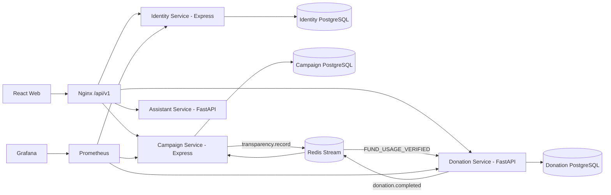

# CharityConnect — Kết nối từ thiện & quyên góp minh bạch

CharityConnect là nền tảng web tiếng Việt cho ba vai trò: người quyên góp, tổ chức từ thiện và quản trị viên. Hệ thống tập trung vào kiểm chứng nguồn, chiến dịch đã duyệt, quyên góp có biên nhận, báo cáo sử dụng quỹ, TrustChain/hash-chain và dashboard thống kê minh bạch.

## Chạy nhanh giao diện

Yêu cầu Node.js 20+.

```bash
cd frontend
npm install
npm run dev
```

Mở <http://localhost:5173>. Ở chế độ dữ liệu cục bộ, web vẫn chạy đầy đủ các luồng chính mà không cần Docker hoặc API key.

Tài khoản mẫu dùng chung mật khẩu `Demo@123`:

| Vai trò | Email | Chức năng chính |
|---|---|---|
| Người quyên góp | `donor@demo.vn` | Quyên góp, lưu/theo dõi chiến dịch, thông báo, biên nhận, lịch sử và PDF |
| Tổ chức | `org@demo.vn` | Quản lý chiến dịch, ngân sách, milestone và báo cáo sử dụng quỹ |
| Quản trị viên | `admin@demo.vn` | Kiểm duyệt, quản lý tài khoản, Risk Score, Audit Log và TrustChain anchor |

Khách chưa đăng nhập xem được kiểm chứng nguồn, chiến dịch, thống kê, sổ cái minh bạch và xác minh biên nhận. Các chức năng theo vai trò yêu cầu đăng nhập đúng quyền.

## Cấu hình tùy chọn

Khi cần kết nối dịch vụ thật, sao chép `.env.example` thành `.env` và điền biến môi trường tương ứng.

- AI Assistant: `ANTHROPIC_API_KEY` hoặc `OPENAI_API_KEY`. Bot ưu tiên dữ liệu nội bộ CharityConnect; câu hỏi ngoài phạm vi mới dùng tìm kiếm web có URL nguồn nếu provider được cấu hình.
- Gmail: `GMAIL_CLIENT_ID`, `GMAIL_CLIENT_SECRET`, `GMAIL_SENDER_EMAIL`, sau đó chạy `cd backend/identity && npm run gmail:authorize`. Refresh token được ghi vào `.env` và không được commit.
- Sepolia: `ANCHOR_RPC_URL`, `ANCHOR_PRIVATE_KEY`, `ANCHOR_CHAIN_ID=11155111`, `ANCHOR_EXPLORER_URL`. Nếu không cấu hình, anchor chạy ở chế độ nội bộ `LOCAL_SIMULATION`.

Không ghi API key, OAuth token, private key, database URL hoặc file `.env` vào source code.

## Chạy toàn bộ hệ thống

Yêu cầu Docker Desktop.

```bash
copy .env.example .env
docker compose up --build
```

Các cổng mặc định:

| Thành phần | URL |
|---|---|
| Web | <http://localhost:5173> |
| API Gateway | <http://localhost:8080/api/v1> |
| Grafana | <http://localhost:3000> |
| Prometheus | <http://localhost:9090> |
| SonarQube | `docker compose --profile quality up sonarqube` → <http://localhost:9000> |

Nếu đã có volume PostgreSQL cũ, áp dụng migration trong từng service trước khi khởi động lại stack.

## Luồng nghiệp vụ chính

1. Tổ chức đăng ký và nộp hồ sơ xác minh.
2. Admin duyệt hoặc từ chối hồ sơ tổ chức.
3. Tổ chức đã xác minh tạo chiến dịch, lập ngân sách/milestone và nộp duyệt.
4. Admin duyệt chiến dịch.
5. Donor đăng nhập, quyên góp cho chiến dịch đã duyệt và nhận biên nhận.
6. Donation Service ghi receipt và ledger entry chống sửa dữ liệu.
7. Tổ chức nộp báo cáo sử dụng quỹ có bằng chứng.
8. Admin duyệt báo cáo, cập nhật timeline tác động, escrow và ledger `FUND_USAGE_VERIFIED`.
9. Người dùng kiểm tra `/minh-bach` hoặc `/xac-minh-bien-nhan`.

## Kiến trúc



Mỗi service sở hữu database riêng, không truy vấn chéo database. Các tích hợp liên service đi qua API nội bộ hoặc Redis Stream với `event_id` idempotent.

Donation Service sở hữu hash-chain SHA-256 trong `ledger_entries`. Mỗi hash tính từ canonical JSON của bản ghi và `previous_hash`; genesis dùng 64 số `0`. Tối đa 100 ledger hash liên tục được gom thành Merkle root để tạo anchor. Payload công khai không chứa tên, email hoặc donor ID. Đây là cơ chế chống sửa dữ liệu, không phải mạng blockchain phi tập trung và không dùng ví/token/crypto.

## Vai trò và quyền

- Public: xem kiểm chứng nguồn, chiến dịch, thống kê, minh bạch, xác minh biên nhận và chatbot.
- Donor: quản lý tài khoản, đổi mật khẩu, phiên đăng nhập, yêu thích/theo dõi, thông báo, quyên góp, biên nhận, lịch sử và PDF năm.
- Organization: quản lý chiến dịch nháp/từ chối, financial plan, milestone và báo cáo sử dụng quỹ.
- Admin: quản lý tài khoản, khóa/mở user, kiểm duyệt tổ chức/chiến dịch/báo cáo, Risk Score, Audit Log và TrustChain anchor.

Dữ liệu nháp hoặc bị từ chối được sửa/xóa mềm theo quyền. Donation amount, receipt number, ledger entry, Merkle proof, anchor, verified evidence hash và audit log là bất biến.

## API chính

Gateway công khai dưới `/api/v1`:

- Identity: `/auth/*`, `/profile`, `/sessions`, `/me/*`, `/admin/users`, `/admin/organizations/*`
- Campaign: `/campaigns/*`, `/organization/campaigns/*`, `/admin/campaigns/*`
- Impact: `/campaigns/{id}/impact-reports`, `/organization/campaigns/{id}/impact-reports`, `/admin/impact-reports/*`
- Donation: `/donations/*`, `/organization/donations/*`, `/transparency/*`
- Assistant: `/assistant/chat`, `/assistant/capabilities`, `/assistant/role-guide`, `/assistant/analyze-source`
- Content Verify: `/content/home`, `/content/articles`, `/content/alerts`, `/content/sources`, `/content/kpis`

OpenAPI:

- Identity: `http://identity-service:3001/openapi.json`
- Campaign: `http://campaign-service:3002/openapi.json`
- Donation: `http://donation-service:8000/openapi.json` hoặc `/docs`

## Kiểm thử

```bash
cd frontend
npm test
npm run build

cd ../backend/assistant
pytest

cd ../donation
pytest
```

Ngưỡng coverage mục tiêu: tối thiểu 80%. KPI vận hành gồm chain integrity 100%, duplicate ledger effect 0, ledger append lag p95 < 5 giây, evidence review p95 < 48 giờ, fund-usage consistency = 0 VND, API p95 < 750 ms và error rate < 1%.

## Deploy

### Vercel frontend

- Root Directory: `frontend`
- Build Command: `npm run build`
- Output Directory: `dist`
- Env cho bản preview không có backend: `VITE_USE_MOCK_API=true`
- Env khi dùng backend thật: `VITE_USE_MOCK_API=false`, `VITE_API_BASE_URL=https://<gateway-domain>/api/v1`, `VITE_ASSISTANT_URL=https://<assistant-domain>`

### Backend

Deploy Docker services trên Render, Railway hoặc VPS:

- gateway/nginx
- identity
- campaign
- donation
- assistant
- PostgreSQL riêng cho identity/campaign/donation
- Redis managed

Secrets phải đặt trong dashboard cloud, không commit vào Git.

### Render quick fix

Nếu tạo Render Web Service dạng Docker từ root repository, Render sẽ tìm `./Dockerfile`. Repo đã có root `Dockerfile` để build `frontend` và serve static trên `$PORT`.

- Runtime: Docker
- Dockerfile Path: `./Dockerfile`
- Docker Context: `.`
- Health Check Path: `/`
- Env preview: `VITE_USE_MOCK_API=true`

Nếu muốn deploy backend thật, tạo service Docker riêng cho gateway/identity/campaign/donation/assistant thay vì dùng chung root frontend image.

## Tài liệu đồ án

Bộ tài liệu nộp CapStone được tạo trong `../outputs/CharityConnect_CapStone_Final/`, gồm Proposal, Project Plan, Backlog, User Stories, Architecture, Database Design, UI Design, Test Plan, Test Case, Sprint Backlog, Code Standard, Meeting và Reflection.

Xem thêm cấu trúc repo tại [PROJECT_STRUCTURE.md](PROJECT_STRUCTURE.md) và mô tả Content Verify tại [CONTENT_VERIFY.md](CONTENT_VERIFY.md).
